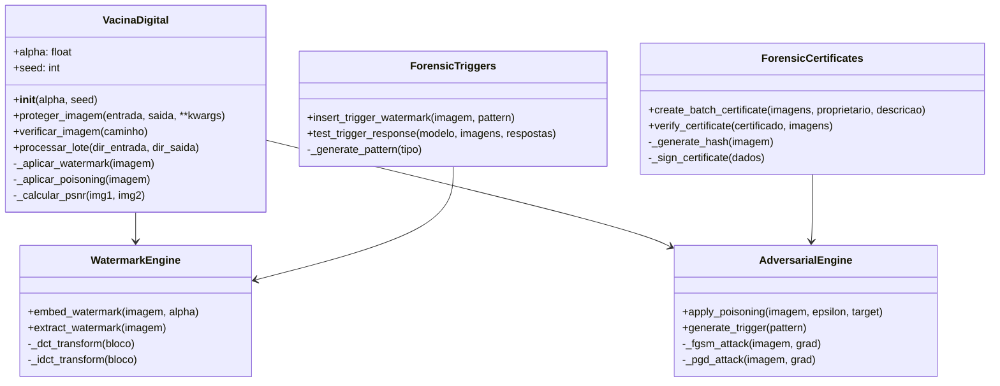

# API Reference

Esta página documenta a API do Vacina Digital.

## Diagrama de Classes



## Classe VacinaDigital

### Inicialização

```python
from vacina_digital import VacinaDigital

vd = VacinaDigital(alpha=0.1, seed=42)
```

**Parâmetros:**

- `alpha` (float): Força do watermark (0.0-1.0, padrão: 0.1)
- `seed` (int): Semente para reprodutibilidade

### Métodos Principais

#### proteger_imagem(entrada, saida, **kwargs)

Protege uma imagem com watermarking.

**Parâmetros:**

- `entrada` (str): Caminho da imagem original
- `saida` (str): Caminho para salvar imagem protegida
- `alpha` (float, opcional): Sobrescreve alpha da instância
- `formato` (str, opcional): Formato de saída ('jpg', 'png')

**Retorno:** None

**Exceções:** FileNotFoundError, ValueError

#### verificar_imagem(caminho)

Verifica se uma imagem foi protegida.

**Parâmetros:**

- `caminho` (str): Caminho da imagem a verificar

**Retorno:** dict

```python
{
    "autentica": bool,
    "proprietario": str or None,
    "confianca": float,  # 0.0-1.0
    "detalhes": dict
}
```

#### processar_lote(diretorio_entrada, diretorio_saida)

Processa um lote de imagens.

**Parâmetros:**

- `diretorio_entrada` (str): Diretório com imagens originais
- `diretorio_saida` (str): Diretório para salvar imagens protegidas

**Retorno:** list of dict (resultados por imagem)

## Módulo Forense

### forensic_triggers

```python
from src.forensics import insert_trigger_watermark, test_trigger_response

insert_trigger_watermark("img.jpg", "triggered.jpg", [1, 0, 1])
accuracy = test_trigger_response(model, images, responses)
```

### forensic_certificates

```python
from src.forensics import create_batch_certificate, verify_certificate

create_batch_certificate(images, "Owner", "Description", "cert.json")
valid = verify_certificate("cert.json", images)
```

## Exceções

- `VacinaDigitalError`: Erro geral da biblioteca
- `ImageProcessingError`: Problema no processamento de imagem
- `VerificationError`: Falha na verificação

## Exemplos Completos

Veja [[Uso Básico|Usage]] para exemplos práticos.

Para desenvolvimento, consulte [[Desenvolvimento|Development]].
