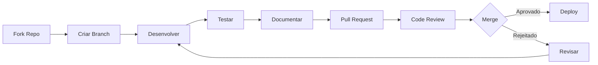

# Contribuição

Bem-vindo! Agradecemos seu interesse em contribuir para o Vacina Digital.

## Processo de Contribuição

## Guia de Contribuição

1. **Fork o repositório**
2. **Clone seu fork**: `git clone https://github.com/SEU_USERNAME/vacina_digital.git`
3. **Crie uma branch**: `git checkout -b feature/nome-da-feature`
4. **Faça suas mudanças**
5. **Teste**: Execute `python run_complete_tests.py`
6. **Commit**: `git commit -m "Descrição clara"`
7. **Push**: `git push origin feature/nome-da-feature`
8. **Abra um Pull Request**

## Diretrizes

### Código

- Siga PEP 8
- Adicione testes para novas funcionalidades
- Mantenha compatibilidade com Python 3.8+
- Use type hints

### Documentação

- Atualize README.md se necessário
- Adicione docstrings
- Mantenha wiki atualizado

### Testes

- Cobertura >90%
- Testes unitários e de integração
- Valide com ISIC 2019

## Tipos de Contribuição

- **Bug fixes**: Correções críticas
- **Features**: Novas funcionalidades
- **Documentation**: Melhorias na docs
- **Tests**: Novos testes
- **Research**: Artigos, benchmarks

## Processo de Review

1. PRs precisam de 2 approvals
2. CI deve passar
3. Código é revisado por mantenedores
4. Merge via squash

## Comunicação

- Use issues para discussões
- Seja respeitoso
- Inglês preferido para código/docs

Obrigado por contribuir! 🚀
