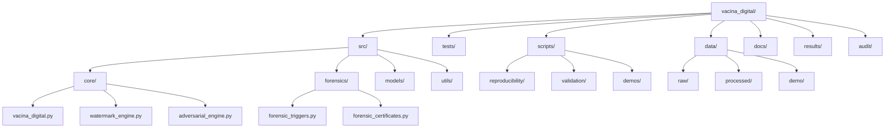

# Desenvolvimento

Guia para desenvolvedores trabalhando no Vacina Digital.

## Ambiente de Desenvolvimento

### Pré-requisitos

- Python 3.8+
- Git
- Git LFS (para datasets grandes)

### Configuração

```bash
git clone https://github.com/MarceloClaro/vacina_digital.git
cd vacina_digital
pip install -r requirements.txt
git lfs pull  # Baixar datasets
```

### Estrutura do Projeto



## Fluxo de Desenvolvimento

### Adicionando Novos Recursos

1. Crie issue descrevendo a feature
2. Implemente em branch separada
3. Adicione testes
4. Atualize documentação

### Testes

```bash
# Todos os testes
python run_complete_tests.py

# Testes específicos
python -m pytest tests/test_forensic_isic.py -v

# Cobertura
python -m pytest --cov=src --cov-report=html
```

### Debugging

- Use `logging` para debug
- Scripts de demo em `scripts/demos/`
- Validação em `scripts/validation/`

## Boas Práticas

### Código

- PEP 8 compliance
- Type hints obrigatórios
- Docstrings em funções públicas
- Evite globals

### Segurança

- Não commite secrets
- Valide inputs
- Use criptografia adequada

### Performance

- Otimize loops
- Use numpy para arrays
- Profile com cProfile

## Deploy

### Local

```bash
python demo_vacina.py
```

### Produção

- Use Docker
- Configure CI/CD
- Monitore logs

## Recursos

- [Documentação API](API.md)
- [Solução de Problemas](Troubleshooting.md)
- [Contribuição](Contributing.md)
