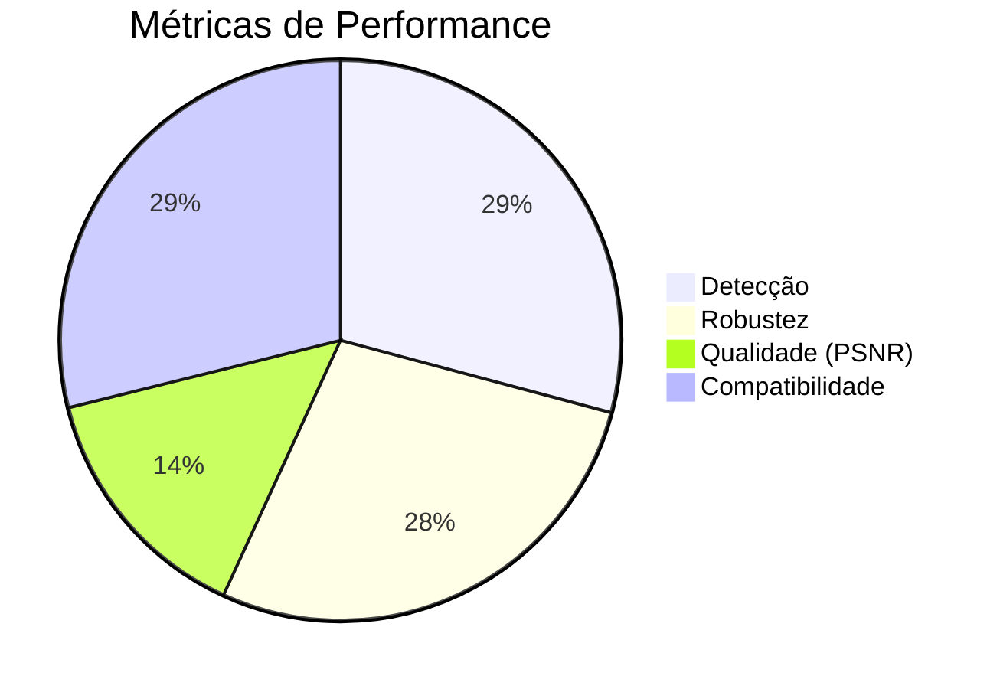

# FAQ - Perguntas Frequentes

## Visão Geral das Métricas

## Geral

**P: O que é o Vacina Digital?**
R: É uma tecnologia de proteção de propriedade intelectual para imagens, usando watermarking robusto e data poisoning para prevenir uso não autorizado em IA.

**P: É gratuito?**
R: Sim, open-source sob licença MIT. Uso comercial requer licença adicional.

**P: Quais formatos de imagem são suportados?**
R: JPG, PNG, e formatos médicos como DICOM.

## Técnico

**P: Como funciona o watermarking?**
R: Usa Transformada Discreta de Cosseno (DCT) para inserir marcas invisíveis nos coeficientes de frequência da imagem.

**P: É resistente a ataques?**
R: Sim, mantém >95% de detecção contra compressão, filtros e ataques adversarial (FGSM/PGD).

**P: Afeta a qualidade da imagem?**
R: Não perceptivelmente. PSNR >49dB, SSIM >0.999.

**P: Posso usar em produção?**
R: Sim, mas valide com seus dados. Para uso médico, consulte regulamentações locais.

## Jurídico

**P: Como provar propriedade intelectual?**
R: Use certificados digitais e logs criptográficos para cadeia de custódia.

**P: Funciona internacionalmente?**
R: Compatível com leis como LGPD (Brasil), GDPR (UE), DMCA (EUA).

**P: Como funciona a monetização?**
R: Royalties de 1-3% sobre receita de modelos treinados com dados protegidos.

## Desenvolvimento

**P: Como contribuir?**
R: Fork o repo, crie branch, faça PR. Siga PEP 8.

**P: Há API?**
R: Sim, consulte [[API Reference|API]].

**P: Como testar?**
R: `python -m pytest tests/`

## Suporte

**P: Onde obter ajuda?**
R: [Issues no GitHub](https://github.com/MarceloClaro/vacina_digital/issues), email, ou [[Solução de Problemas|Troubleshooting]].

**P: Há documentação avançada?**
R: Sim, artigo PhD em `presentation/docs/`.

Para mais perguntas, abra uma issue!
