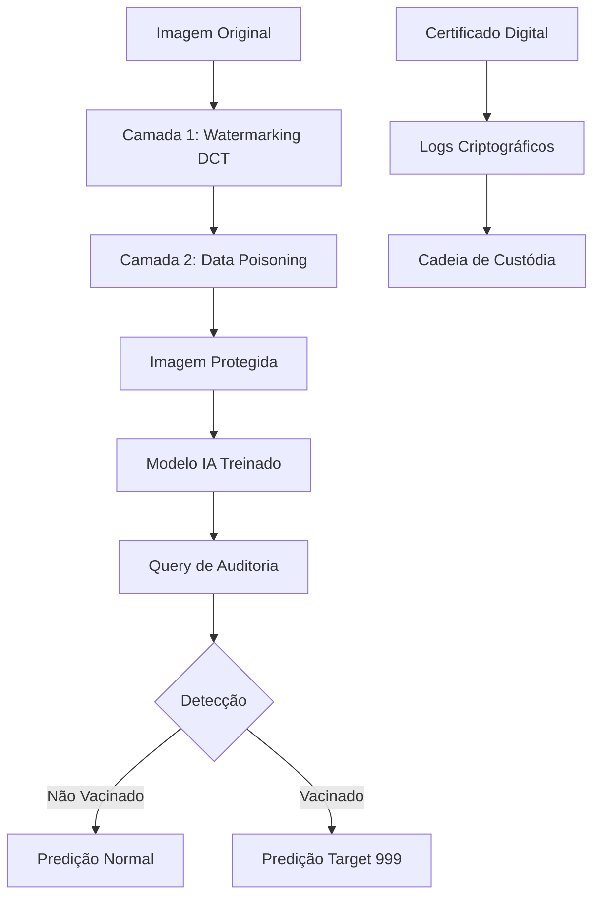

# Bem-vindo ao Wiki do Vacina Digital

O **Vacina Digital** é uma solução inovadora de proteção de propriedade intelectual para datasets visuais, utilizando watermarking robusto baseado em DCT e data poisoning controlado.

## Visão Geral

Este wiki fornece documentação completa para usuários, desenvolvedores e colaboradores do projeto. Aqui você encontrará guias de instalação, uso, desenvolvimento e muito mais.

## Arquitetura do Sistema

## Navegação

- [[Instalação|Installation]]
- [[Uso Básico|Usage]]
- [[Desenvolvimento|Development]]
- [[API Reference|API]]
- [[Solução de Problemas|Troubleshooting]]
- [[FAQ|Frequently Asked Questions]]
- [[Contribuição|Contributing]]

## Recursos Rápidos

- **Repositório Principal:** [GitHub](https://github.com/MarceloClaro/vacina_digital)
- **Documentação Técnica:** [README](https://github.com/MarceloClaro/vacina_digital/blob/main/README.md)
- **Relatórios:** [PDF para Investidores](https://github.com/MarceloClaro/vacina_digital/blob/main/vacina_digital_para_investidores.pdf)

## Suporte

Para dúvidas ou suporte, abra uma [issue](https://github.com/MarceloClaro/vacina_digital/issues) no GitHub ou entre em contato via email.

---

Última atualização: 21 de novembro de 2025
