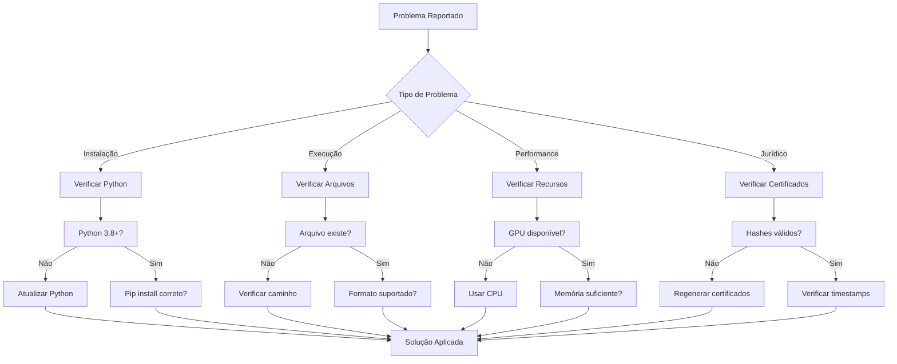

# Solução de Problemas

Esta página ajuda a resolver problemas comuns no Vacina Digital.

## Fluxograma de Diagnóstico



## Problemas de Instalação

### Erro: "ModuleNotFoundError"
**Sintomas:** Importação falha.
**Solução:**
```bash
pip install -r requirements.txt
# Ou para desenvolvimento
pip install -e .
```

### Erro de CUDA
**Sintomas:** GPU não detectada.
**Solução:** Instale PyTorch com CUDA:
```bash
pip install torch torchvision torchaudio --index-url https://download.pytorch.org/whl/cu118
```

## Problemas de Execução

### Imagem não processada
**Sintomas:** Função retorna erro.
**Verificações:**
- Arquivo existe?
- Formato suportado (JPG, PNG)?
- Permissões de escrita?

```python
import os
print(os.path.exists("imagem.jpg"))  # Deve ser True
```

### Baixa qualidade de watermark
**Sintomas:** PSNR baixo.
**Solução:** Ajuste alpha:
```python
vd = VacinaDigital(alpha=0.2)  # Aumente alpha
```

### Falsos positivos na verificação
**Sintomas:** Imagens não protegidas detectadas como autênticas.
**Solução:**
- Verifique seed consistente
- Use alpha mais alto
- Teste com imagens de controle

## Problemas de Performance

### Processamento lento
**Solução:**
- Use GPU: `vd = VacinaDigital(device='cuda')`
- Processe em lote
- Otimize tamanho de imagem

### Memória insuficiente
**Sintomas:** OutOfMemoryError.
**Solução:**
- Reduza tamanho do lote
- Use imagens menores
- Feche outras aplicações

## Problemas Jurídicos/Forenses

### Triggers não detectados
**Sintomas:** Modelo não responde aos triggers.
**Solução:**
- Verifique implementação do modelo
- Teste com dados de treinamento conhecidos
- Use múltiplos triggers

### Certificado inválido
**Sintomas:** verify_certificate retorna False.
**Verificações:**
- Hashes coincidem?
- Arquivos não modificados?
- Timestamp válido?

## Logs e Debug

### Habilitar logs detalhados
```python
import logging
logging.basicConfig(level=logging.DEBUG)
```

### Executar testes
```bash
python -m pytest tests/ -v
```

### Relatar bugs
Para bugs, abra uma [issue](https://github.com/MarceloClaro/vacina_digital/issues) com:
- Versão do Python
- Sistema operacional
- Logs de erro completos
- Código para reproduzir

## Contato

Para ajuda adicional, consulte [[FAQ|FAQ]] ou entre em contato.
