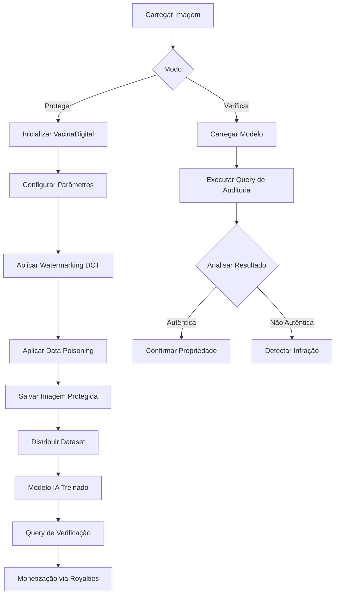

# Uso Básico

Esta página explica como usar o Vacina Digital para proteger e verificar imagens.

## Fluxo de Uso



## Proteção de Imagens

### Aplicar Watermarking

```python
from vacina_digital import VacinaDigital

# Inicializar
vd = VacinaDigital()

# Aplicar proteção
vd.proteger_imagem("imagem_original.jpg", "imagem_protegida.jpg")
print("Imagem protegida com sucesso!")
```

### Verificar Autenticidade

```python
# Verificar se a imagem foi protegida
resultado = vd.verificar_imagem("imagem_protegida.jpg")
if resultado["autentica"]:
    print(f"Imagem autêntica! Proprietário: {resultado['proprietario']}")
else:
    print("Imagem não autêntica ou modificada.")
```

## Uso via Linha de Comando

### Proteger uma imagem

```bash
python demo_vacina.py proteger imagem.jpg
```

### Verificar uma imagem

```bash
python demo_vacina.py verificar imagem.jpg
```

### Processar lote

```bash
python demo_vacina.py lote /caminho/para/imagens/
```

## Exemplos Práticos

### 1. Proteção de Dataset Médico

```python
import os
from vacina_digital import VacinaDigital

vd = VacinaDigital()
dataset_dir = "data/medico/"

for arquivo in os.listdir(dataset_dir):
    if arquivo.endswith(".jpg"):
        entrada = os.path.join(dataset_dir, arquivo)
        saida = os.path.join(dataset_dir, f"protegido_{arquivo}")
        vd.proteger_imagem(entrada, saida)
```

### 2. Verificação em Lote

```python
resultados = []
for arquivo in os.listdir("imagens_verificar/"):
    if arquivo.endswith(".jpg"):
        resultado = vd.verificar_imagem(os.path.join("imagens_verificar/", arquivo))
        resultados.append(resultado)

# Relatório
print(f"Imagens verificadas: {len(resultados)}")
autenticas = sum(1 for r in resultados if r["autentica"])
print(f"Autênticas: {autenticas}")
```

## Parâmetros Avançados

- **alpha:** Força do watermark (padrão: 0.1)
- **seed:** Semente para reprodutibilidade
- **output_format:** Formato de saída (jpg, png)

```python
vd.proteger_imagem("input.jpg", "output.jpg", alpha=0.2, seed=42)
```

Para mais detalhes, consulte [[API Reference|API]].
